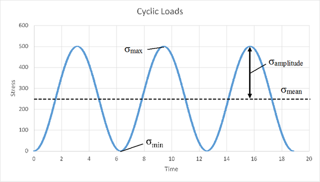
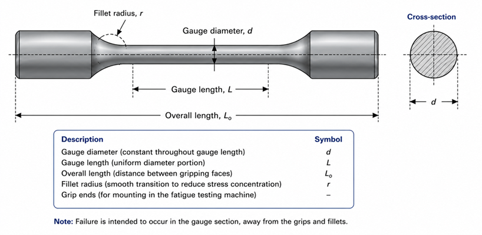

### Physical Concept

Many engineering components such as rotating shafts, gears, springs, crankshafts, railway axles, aircraft components, and bridges are subjected to repeated or fluctuating loads during service. Although the applied stress may be well below the yield strength of the material, repeated loading can eventually cause failure. This phenomenon is known as **fatigue**.

Unlike static failure, fatigue failure occurs gradually through the formation and growth of microscopic cracks. Since these cracks are often invisible to the naked eye until final fracture, fatigue failure can occur suddenly and without significant prior deformation.

### Everyday Intuition

Consider bending a paper clip back and forth repeatedly. Although each bend is relatively small, the paper clip eventually breaks after several cycles. This happens because repeated loading causes microscopic cracks to initiate and grow until the remaining cross-section can no longer support the load. Metallic components subjected to repeated loading behave in a similar manner.

### Types of Fatigue Testing

Several experimental methods are used to study fatigue behaviour depending on the type of loading applied.

- **Rotating Beam Fatigue Test** – The specimen rotates while a constant bending load is applied, producing alternating tensile and compressive stresses.
- **Axial Fatigue Test** – The specimen is subjected to repeated axial tensile and/or compressive loads.
- **Torsional Fatigue Test** – The specimen experiences repeated twisting moments.
- **Strain-Controlled Fatigue Test** – The applied cyclic strain is controlled instead of the applied stress and is generally used for low-cycle fatigue studies.

**This virtual laboratory demonstrates the principle of a Rotating Beam Fatigue Test**, in which a rotating circular specimen is subjected to a constant bending load that produces alternating tensile and compressive stresses until fatigue failure occurs.

### Rotating Beam Fatigue Test

In a rotating beam fatigue test, a circular specimen is mounted horizontally and subjected to a constant bending load while rotating at a constant speed.

As the specimen rotates,

- the upper surface alternates between tension and compression,
- the lower surface experiences the opposite stress state,
- each revolution represents one complete stress cycle.

Repeated stress reversals gradually initiate microscopic cracks, which propagate with increasing number of cycles until sudden fracture occurs.

<b>Figure 1. Typical rotating beam fatigue test showing the rotating specimen subjected to a constant bending load.</b>

### Standard Fatigue Specimen

A rotating beam fatigue specimen generally consists of

- a uniform gauge section,
- smooth fillet transitions,
- enlarged ends for mounting in the testing machine.

The gauge section is designed so that failure occurs away from the grips and stress concentrations.

<b>Figure 2. Typical rotating beam fatigue specimen with gauge section, fillets, and gripping ends.</b>

### Stages of Fatigue Failure

Fatigue failure generally occurs in three stages:

1. **Crack initiation** at locations of high stress concentration or surface imperfections.
2. **Crack propagation** due to repeated cyclic loading.
3. **Final fracture** when the remaining cross-sectional area becomes insufficient to carry the applied load.

Because crack growth is gradual but final fracture is sudden, fatigue failures are often dangerous in engineering structures.

### Mathematical Representation

The fatigue behaviour of a material is represented using the **S–N curve**, which relates the applied stress amplitude to the number of cycles required for failure.

Where,

- \(S\) = Stress amplitude
- \(N\) = Number of cycles to failure

As the applied stress decreases, the fatigue life generally increases.

Many steels exhibit an **endurance limit**, below which fatigue failure does not occur even after an indefinitely large number of loading cycles.

### Apparatus-Specific Application

The virtual fatigue testing machine demonstrates the working principle of a rotating beam fatigue test. During the simulation, students observe

- alternating bending stresses,
- applied force,
- stress developed in the specimen,
- number of loading cycles,
- corresponding S–N relationship.

The simulation illustrates how cyclic loading gradually leads to fatigue failure.

### Engineering Significance

Fatigue testing is essential in the design of machine and structural components that experience repeated loading.

Knowledge of fatigue behaviour helps engineers

- estimate service life,
- determine safe operating stresses,
- reduce unexpected failures,
- improve reliability,
- design safer engineering systems.
